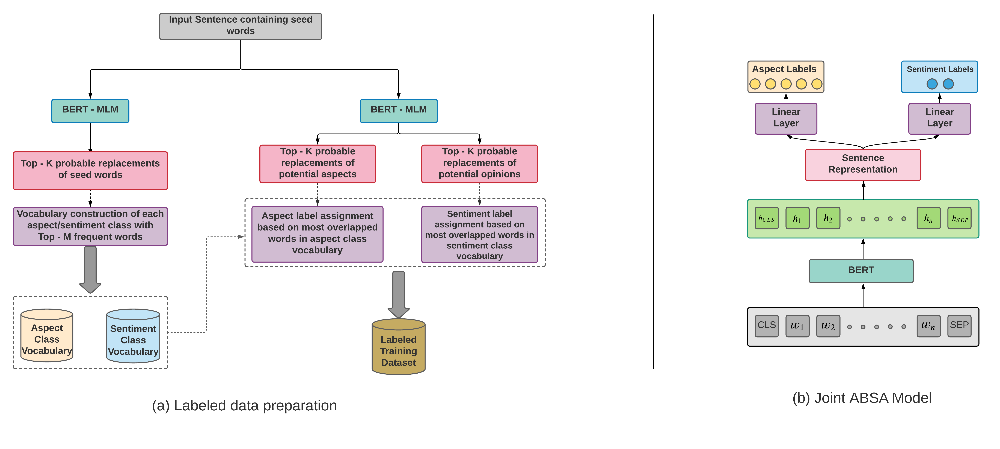

# LCR+CASC

PyTorch implementation of LCR+CASC: weakly supervised aspect category and sentiment classification with Left-Center-Right context-aware RoTHop++ attention. Extends the CASC code from https://www.github.com/Raghu150999/UnsupervisedABSA.

## Paper

This work originated from my 2022 MSc thesis in Econometrics and was subsequently developed into the following peer-reviewed publication:

**"Weakly-Supervised Left-Center-Right Context-Aware Aspect Category and Sentiment Classification"**
Gonem Lau, Flavius Frasincar, Finn van der Knaap
*Proceedings of the 24th International Conference on Web Engineering (ICWE 2024), Springer.*
[doi:10.1007/978-3-031-62362-2_19](https://doi.org/10.1007/978-3-031-62362-2_19)

## What this repository provides

- The full weakly supervised labeling pipeline (SemEval-style unsupervised ABSA preprocessing: vocabularies, span extraction, MLM top-k scoring, z-score thresholding).
- The CASC `BERTLinear` baseline and the LCR `LCRRothopPP` two-tower model in PyTorch (the original TensorFlow parts ported), with a unified CE + GCE + L1/L2 loss.
- A single CLI with named YAML hyperparameter recipes, automatic multi-GPU (`DataParallel`) fan-out, checkpoint resume, and per-run artifacts.
- Standalone evaluation over the 2015/2016 SemEval ABSA test sets (single and multiple aspect).

## Key finding

With gold aspect targets, LCR+CASC outperforms CASC in most settings, with particularly large improvements for sentences containing multiple aspects. For example, on 2016 multi-aspect aspect category classification, Macro-F1 improves from 77.00 to 94.10. When targets must instead be extracted automatically, performance drops substantially, identifying aspect-term extraction as the main bottleneck in the end-to-end pipeline.

<p align="center">
  
</p>

## Setup
Python 3.10+. PyTorch is the only deep-learning framework (the original TensorFlow parts have been ported).

```
git clone https://github.com/Gogonemnem/LCR-PLUS-CASC.git && cd LCR-PLUS-CASC
pip install -e .
python -m spacy download en_core_web_sm
```

After installation the CLI is available as `lcr-casc` (equivalent to `python main.py`).

## Pipeline
Everything is driven from a single CLI. A named YAML recipe (`--config <name>`, defaulting to `casc.yaml` or `lcr.yaml`) supplies the hyperparameters; unlisted fields keep their dataclass defaults, and per-run CLI flags override the recipe.

1. `prep` — CASC-style unsupervised labeling: build the domain vocabularies (`datasets/<domain>/lexicons/`), extract aspect spans, score them with MLM replacements, and threshold into `datasets/<domain>/label.txt`.
2. `casc` — train/evaluate the baseline `BERTLinear` CASC model.
3. `lcr` — train/evaluate the two-tower `LCRRothopPP` model (with optional `--tune` Optuna search) using the unified GCE + L1/L2 loss.

Which phases run is implied by the data paths: `--train-path` trains, `--val-path` adds a validation split (else no validation), `--test-path` evaluates. Give both train and test to train then evaluate; give only `--test-path` to evaluate a saved checkpoint.

```
lcr-casc prep
lcr-casc casc --train-path <train.txt> --test-path <test.txt>
lcr-casc lcr --train-path <train.txt> --test-path <test.txt>
lcr-casc lcr --tune --train-path <train.txt>
lcr-casc lcr --test-path <test.txt> --load <run_dir>   # eval-only
```

Each run writes artifacts to `output/<config-name>/<timestamp>_<kind>/`: `config.json`, `run.log`, `*_predictions.csv`, plus `casc_model.pth` / `casc_checkpoint.pth` (CASC) or `lcr_model.pth` / `lcr_checkpoint.pth` (LCR). Resume a crashed run with `--resume` (newest such checkpoint), `--resume <run-dir>`, or `--resume <path/to/checkpoint.pth>`. `evaluate_test.py` gives a standalone sklearn classification report over the saved predictions.

Devices: by default every torch module is wrapped with `DataParallel` and fans batches out across all visible GPUs (labeling scoring and training alike). `--device cuda:N` pins one GPU; `--device cpu` forces CPU.

## Data
The labeled data comes from the SemEval 2015 (Wang & Ho) and SemEval 2016 Track 2 (Tang et al.) aspect-based sentiment analysis restaurant-domain datasets. The original XML sources plus the flat `train.txt`/`test.txt` files live under `datasets/restaurant/raw/` (laptop domain: `datasets/laptop/raw/`, same layout). The per-year `train_{single,multiple}.txt` / `test_{single,multiple}.txt` files are regenerated from those XMLs by `lcr_plus_casc/labeling/semeval_reader.py`.

The **training rows** (`datasets/restaurant/label.txt`) are not the gold files but the product of the unsupervised preprocessing: `prep` runs the MLM scoring pipeline over the unlabeled `raw/train.txt` (≈17k sentences) and thresholds the scores into aspect + polarity labels.

## Reproducing the paper
The paper's LCR+CASC numbers (Tables 3–4, no-gold AUE part) use the Table 7 hyperparameters with a val=test selection:

```
lcr-casc --config lcr_q01_lr3 --seed 0 lcr \
    --train-path datasets/restaurant/label.txt \
    --val-path   datasets/restaurant/2016/test_single.txt \
    --test-path  datasets/restaurant/2016/test_single.txt
```

Run for `--seed 0..4` and average. The CASC baseline is the same command with `casc` and `--config casc` in place of `lcr`. A full clean re-label is `lcr-casc --domain restaurant prep` (delete `datasets/restaurant/lexicons/dict_*.txt` and `intermediate/scores.txt` first).

## Dataset layout
Per domain under `datasets/<domain>/`:
- `raw/` — original SemEval/Tang training data (XML + root `train.txt`/`test.txt`)
- `lexicons/` — auto-built seed lexicons (`dict_*.txt`)
- `intermediate/` — `scores.txt` and training embeddings
- `label.txt` — thresholded unsupervised aspect/polarity labels (training rows)
- `2015/`, `2016/` — per-year `train_{single,multiple}.txt` and `test_{single,multiple}.txt`

Regenerate the per-year files from the raw XMLs with `lcr_plus_casc/labeling/semeval_reader.py`, or re-run `prep` (delete `lexicons/dict_*.txt` and `intermediate/scores.txt` first for a full re-label).

## Config recipes
Under `configs/`:
- `casc.yaml` — BERTLinear defaults (GCE q, learning rate, batch size).
- `lcr.yaml` — LCR paper parameters (hidden 768, hop 6, q 0.4, l1=l2 1e-7, drop1 0.5 / drop2 0.3).
- `lcr_q01_lr3.yaml` — LCR Table-7 variant (q 0.1, lcr_learning_rate 1e-3).

## Layout
```
lcr_plus_casc/
  config.py          # TrainingConfig / DomainConfig dataclasses, recipe loader, CKPT names
  data.py            # dataset loaders: SemEval TSVs, unlabeled rows, tensor datasets
  filter_words.py    # shared stop-word list
  losses.py          # unified absa_loss (CE + GCE + L1/L2), metrics
  runs.py            # per-run output dirs and best/checkpoint artifact resolution
  labeling/          # unsupervised CASC preprocessing
    vocab.py, dictionary.py, split_file.py
    extracter.py     #   span extraction (spaCy + regex + heuristic)
    score_computer.py#   MLM top-k scoring + z-score aggregation
    labeler.py       #   thresholding -> label.txt
    mlm.py           #   masked-LM scorer (DataParallel-aware)
    semeval_reader.py, pipeline.py
  classifiers/
    casc.py          # BERTLinear baseline
    lcr.py           # LCRRothopPP two-tower model
    training.py      # AbsaTrainer (unified CASC/LCR train/tune/evaluate/progress)
main.py              # single CLI entry point
evaluate_test.py     # standalone sklearn report over saved predictions
configs/             # named YAML recipes (casc, lcr, lcr_q01_lr3)
```

## Test environment
Developed and tested with Python 3.12, PyTorch 2.14.0+cu126, transformers 5.17.0 (2-GPU box) and Python 3.13/CPU builds for testing. The `>=` pins in `pyproject.toml` are minimums, not tested combinations.

## Citation
If you use this work, please cite:

```bibtex
@inproceedings{lau2024lcr,
  title     = {Weakly-Supervised Left-Center-Right Context-Aware Aspect Category and Sentiment Classification},
  author    = {Lau, Gonem and Frasincar, Flavius and van der Knaap, Finn},
  booktitle = {Proceedings of the 24th International Conference on Web Engineering (ICWE 2024)},
  publisher = {Springer},
  year      = {2024},
  doi       = {10.1007/978-3-031-62362-2_19}
}
```

## Acknowledgements
The CASC baseline and preprocessing pipeline follow the original code at [Raghu150999/UnsupervisedABSA](https://github.com/Raghu150999/UnsupervisedABSA); the LCR two-tower model and the unified PyTorch training pipeline in this repository are the author's own.
